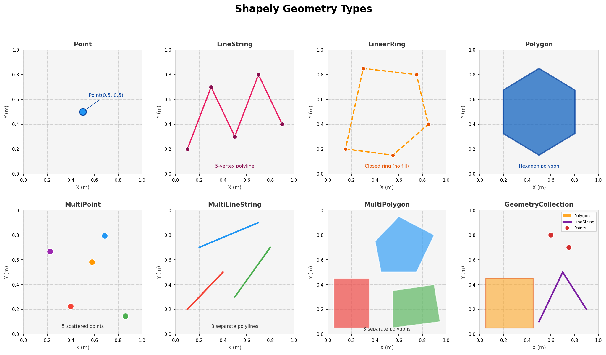
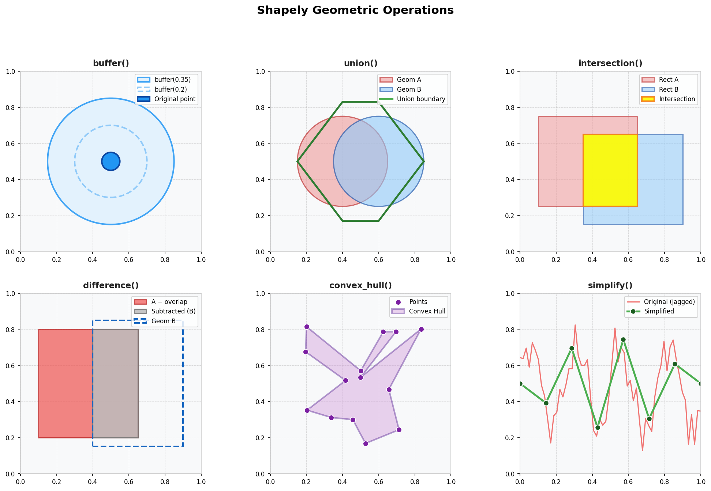
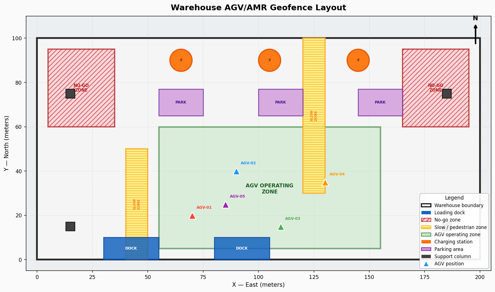

# Shapely Geometry Operations
### Geometric Computation for AGV Geofencing, Field Analysis & Spatial Pipelines
**Author:** Emmanuel Oyekanlu — Principal Data Engineer

---

## Table of Contents
1. [What Is Shapely?](#what-is-shapely)
2. [Shapely's Role in Geospatial Pipelines](#shapelys-role-in-geospatial-pipelines)
3. [Geometric Object Types](#geometric-object-types)
4. [Real-World Use Cases](#real-world-use-cases)
5. [Installation](#installation)
6. [Repository Structure](#repository-structure)
7. [Script-by-Script Guide](#script-by-script-guide)
8. [Performance Notes](#performance-notes)
9. [Integration with GeoPandas](#integration-with-geopandas)
10. [Troubleshooting](#troubleshooting)

---

## Visual Gallery

The images below are generated directly from this repository's code using only `matplotlib` and `numpy` — no external data required.

### Shapely Geometry Types
All 7 Shapely geometry classes: Point, LineString, LinearRing, Polygon, MultiPoint, MultiLineString, MultiPolygon, and GeometryCollection.



### Geometric Operations
Core Shapely operations: `buffer()`, `union()`, `intersection()`, `difference()`, `convex_hull()`, and `simplify()`.



### AGV Warehouse Geofencing
A 200m × 100m warehouse mapped with Shapely polygons: no-go zones, slow zones, AGV operating zone, charging stations, and live AGV positions.



---

## What Is Shapely?

Shapely is a Python library for **planar geometric object manipulation and analysis**. It provides a clean, Pythonic interface to the GEOS library — the same geometry engine used by PostGIS, QGIS, and GDAL.

Shapely operates exclusively in **2D Cartesian space**. It has no knowledge of CRS, map projections, or geographic coordinates. This is intentional: Shapely is the pure geometry engine; GeoPandas wraps it with spatial awareness and CRS management.

Key facts:
- Shapely objects are **immutable** — operations return new objects, never modify in place
- All computations are in the units of the input coordinates (if you feed meters, you get meters²)
- Shapely 2.x (released 2022) brought massive performance improvements via vectorized GEOS operations
- Shapely is a **dependency of GeoPandas** — if you have GeoPandas installed, you have Shapely

---

## Shapely's Role in Geospatial Pipelines

Shapely sits at the foundational layer of the Python geospatial stack:

```
┌─────────────────────────────────────────────────────────┐
│  Application Layer                                       │
│  (Flask API, Airflow DAG, AGV Fleet Manager, Farm App)  │
├─────────────────────────────────────────────────────────┤
│  Analysis Layer                                          │
│  GeoPandas — tabular + spatial operations on datasets   │
│  Folium / Kepler.gl — visualization                      │
├─────────────────────────────────────────────────────────┤
│  Geometry Engine Layer        ← YOU ARE HERE            │
│  Shapely — individual geometry manipulation             │
│  pyproj  — CRS transformation                           │
├─────────────────────────────────────────────────────────┤
│  C Library Layer                                         │
│  GEOS — geometry operations (buffer, union, intersect)  │
│  PROJ — coordinate transformation math                  │
│  GDAL — file format I/O                                 │
└─────────────────────────────────────────────────────────┘
```

### When to Use Shapely Directly (vs. GeoPandas)

Use **Shapely directly** when:
- You're working with individual geometry objects, not tabular datasets
- Building a geometry from scratch in application code (e.g., constructing a zone polygon from config)
- Writing low-level spatial predicates in a hot loop where GeoDataFrame overhead is undesirable
- Implementing geometry validation logic in a data quality module

Use **GeoPandas** when:
- You have a collection of geometries with associated attributes
- You need to join, filter, or aggregate spatial data
- Reading/writing spatial files (GeoJSON, Shapefile, PostGIS)

---

## Geometric Object Types

### Fundamental Types

| Type                | Description                                           | Example Use Case                          |
|---------------------|-------------------------------------------------------|-------------------------------------------|
| `Point`             | Single coordinate (x, y) or (x, y, z)                | AGV position, sensor location, soil sample|
| `LineString`        | Ordered sequence of points forming a line             | AGV travel path, road centerline, row crop|
| `LinearRing`        | Closed LineString (first == last point)               | Field boundary ring (pre-polygon stage)   |
| `Polygon`           | Planar surface with exterior + optional holes         | Field boundary, geofence zone, warehouse  |
| `MultiPoint`        | Collection of Point objects                           | Cluster of soil sample locations          |
| `MultiLineString`   | Collection of LineString objects                      | Road network for a farm or facility       |
| `MultiPolygon`      | Collection of Polygon objects                         | Discontiguous field parcels               |
| `GeometryCollection`| Mixed collection of any geometry types               | Mixed-layer import from a GIS tool        |

### Geometry Properties (available on all types)

```python
geom.area          # Float: area in coordinate units² (0 for points/lines)
geom.length        # Float: perimeter/length in coordinate units
geom.centroid      # Point: geometric center
geom.bounds        # Tuple: (minx, miny, maxx, maxy)
geom.geom_type     # String: 'Point', 'Polygon', etc.
geom.is_valid      # Bool: passes OGC validity rules
geom.is_empty      # Bool: zero-area or degenerate geometry
geom.wkt           # String: Well-Known Text representation
geom.wkb           # Bytes: Well-Known Binary (for database storage)
```

---

## Real-World Use Cases

### 1. AGV / AMR Geofencing (Repo Script 05)

Autonomous ground vehicles in warehouses or agricultural yards need to know:
- **Am I in the allowed operational zone?** → `warehouse_boundary.contains(agv_position)`
- **Am I approaching a no-go zone?** → `no_go_zone.buffer(2.0).contains(agv_position)` (2m warning buffer)
- **Which operational zone am I currently in?** → loop through zone polygons checking `zone.contains(agv_pos)`
- **Is my planned path blocked?** → `planned_path.intersects(obstacle_polygon)`

### 2. Agricultural Field Boundary Analysis

- **Compute field area:** `field_polygon.area` (in m² if coordinates are in UTM meters)
- **Field perimeter:** `field_polygon.length` (meters)
- **Compactness ratio:** `4π × area / perimeter²` (indicates how "square" a field is — affects irrigation efficiency)
- **Check adjacency:** `field_a.touches(field_b)` — are these fields sharing a boundary?
- **Find overlap:** `field_a.intersection(field_b).area` — how many m² do two parcels overlap?

### 3. Row Crop Path Planning

- **Compute headland turns:** buffer the field boundary inward to define the planting area
- **Generate parallel rows:** create a set of LineString objects at fixed spacing across the field
- **Check path clears obstacles:** `row_path.intersects(obstacle_polygon)`

### 4. Warehouse Floor Plan Alignment

When commissioning an AGV system in a new warehouse:
- Import floor plan CAD geometry (DXF → Shapely via ezdxf)
- Use affine transformations (translate, rotate, scale) to align floor plan coordinates to GPS survey points
- Export aligned zone polygons to your fleet management system

---

## Installation

```bash
python -m venv venv
# Windows:
venv\Scripts\activate
# macOS/Linux:
source venv/bin/activate

pip install -r requirements.txt
```

No C-extension build issues: Shapely 2.x ships pre-compiled wheels for all major platforms.

---

## Repository Structure

```
02_shapely_geometry_operations/
├── README.md                        # This file
├── requirements.txt
├── .gitignore
├── 01_geometry_objects.py           # Create and inspect all geometry types
├── 02_geometric_operations.py       # Buffer, union, intersection, convex hull, etc.
├── 03_spatial_predicates.py         # contains, within, intersects, disjoint, etc.
├── 04_affine_transformations.py     # Translate, rotate, scale, skew geometries
└── 05_agv_geofencing_example.py     # Complete warehouse AGV zone check system
```

---

## Script-by-Script Guide

### `01_geometry_objects.py`
Creates every Shapely geometry type from scratch, prints WKT, area, length,
centroid, and bounds. Teaches the geometry object model.

```bash
python 01_geometry_objects.py
```

### `02_geometric_operations.py`
Demonstrates the spatial algebra operations used in real pipelines:
buffer, union, intersection, difference, convex hull, simplify, envelope.
Includes use-case commentary for each.

```bash
python 02_geometric_operations.py
```

### `03_spatial_predicates.py`
Covers the DE-9IM spatial predicate family: contains, within, intersects,
touches, crosses, disjoint, overlaps. Uses a grid of test polygons.

```bash
python 03_spatial_predicates.py
```

### `04_affine_transformations.py`
Shows how to translate, rotate, scale, and skew geometries using
`shapely.affinity`. Demonstrated with a warehouse floor plan alignment scenario.

```bash
python 04_affine_transformations.py
```

### `05_agv_geofencing_example.py`
The capstone script: a complete warehouse AGV zone management system.
Defines a warehouse boundary, inner zones (charging, loading, no-go, slow zones),
and tests AGV positions against each zone. Production-quality commentary throughout.

```bash
python 05_agv_geofencing_example.py
```

---

## Performance Notes

### Shapely 2.x Vectorized Operations

Shapely 2.x introduced `shapely.vectorized` (now `shapely` top-level functions) that operate
on arrays of geometries using GEOS's STR-tree index internally:

```python
import shapely
import numpy as np

# OLD (Shapely 1.x — Python loop):
results = [zone.contains(pt) for pt in points]

# NEW (Shapely 2.x — vectorized, 10-100x faster for large arrays):
results = shapely.contains(zone, np.array(points))
```

For fleet monitoring with thousands of AGV position updates per second, this distinction
matters enormously.

### STRtree Spatial Index

For repeated queries against the same set of polygons, build an `STRtree`:

```python
from shapely.strtree import STRtree

zones = [polygon1, polygon2, ..., polygon_n]
tree = STRtree(zones)

# Query: which zones does this point intersect? (fast O(log n) vs O(n) linear scan)
hits = tree.query(agv_position, predicate='contains')
```

---

## Integration with GeoPandas

Shapely geometries are the native `.geometry` column type in GeoPandas:

```python
import geopandas as gpd
from shapely.geometry import Point

# A single Shapely Point
pt = Point(-121.6, 36.6)

# Wrap in a GeoDataFrame for tabular + spatial operations
gdf = gpd.GeoDataFrame([{"sensor_id": "S01"}], geometry=[pt], crs="EPSG:4326")

# Access the Shapely object back from the GeoDataFrame
shapely_geom = gdf.geometry.iloc[0]   # → Shapely Point
```

Every Shapely method you learn in this repo works identically on geometries
extracted from a GeoDataFrame.

---

## Troubleshooting

**`TopologicalError: The operation 'GEOSIntersection_r' could not be performed.`**
→ One of your geometries is invalid. Fix with `.buffer(0)` (a known Shapely trick):
  `clean_geom = invalid_geom.buffer(0)`

**`ShapelyDeprecationWarning: __len__ for multi-part geometries is deprecated`**
→ Use `len(list(multi_polygon.geoms))` instead of `len(multi_polygon)`

**Empty geometry returned from intersection**
→ The two geometries don't actually overlap. Check with `.intersects()` first.
  Also verify both geometries are in the same coordinate system.

**`ValueError: A LinearRing requires at least 4 coordinates.`**
→ The last coordinate must repeat the first to close the ring.

---

*Built by Emmanuel Oyekanlu — Principal Solution Architect Engineer*

**AGV/AMR systems, precision agriculture, and large-scale data pipelines.**
